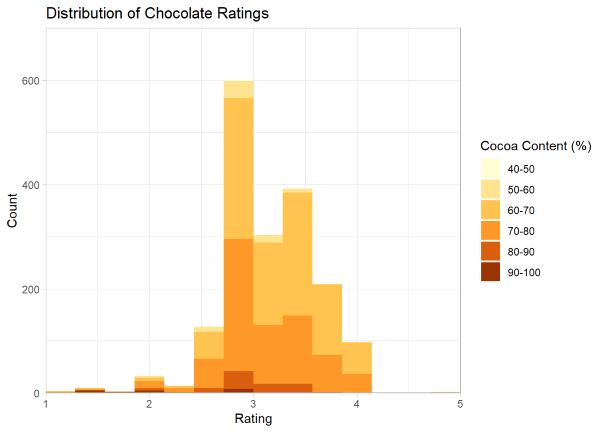
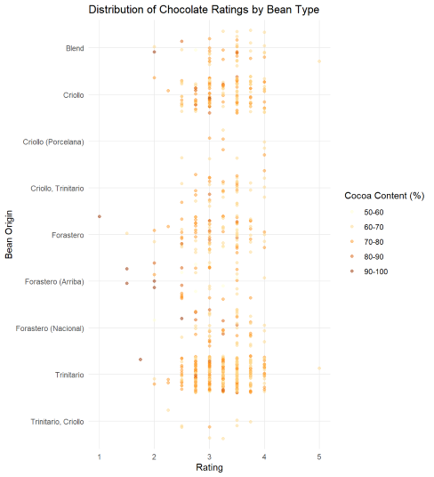

# Chocolate Bar Ratings: Exploratory Data Analysis of Chocolate Ratings Data from Kaggle

This repo contains a simple exercise on the Exploratory Data Analysis of a Kaggle data with professional ratings of chocolates.

You can access the full output of the analysis through the published article on [RPubs](https://rpubs.com/jeandsantos88/chocolate-bar-ratings)

***

# About the Data

The dataset from which the analysis below was done was obtained from the [Flavors of Cacao](http://flavorsofcacao.com/index.html) site and is also available on [Kaggle](https://www.kaggle.com/rtatman/chocolate-bar-ratings).

The dataset contains almost 1800 expert ratings of various chocolate bars from different types of cocoa beans, origins, companies and manufacturing countries. Each rating also contains additional information about the specific bean origin (if known) and information about the percentage of cocoa.

Chocolates were evaluated between 2006 and 2017 on a scale of 1 to 5:

1. Unpleasant
2. Disappointing 
3. Satisfactory (3.0) to praiseworthy (3.75)
4. Premium 
5. Elite 

The rating is a combination of both objective qualities and subjective interpretation.

***
## Reproducing the environment

You can reproduce the environment by using the [`renv`](https://rstudio.github.io/renv/) package and the `renv.lock` file available in this repo.

***

## Questions and Feedback

For questions or feedback please contact me via [LinkedIn](https://www.linkedin.com/in/jeandsantos/) or [email](mailto:jeandsantos88@gmail.com?subject=StrengthFinder%3A%20Questions%20and%20Requests).